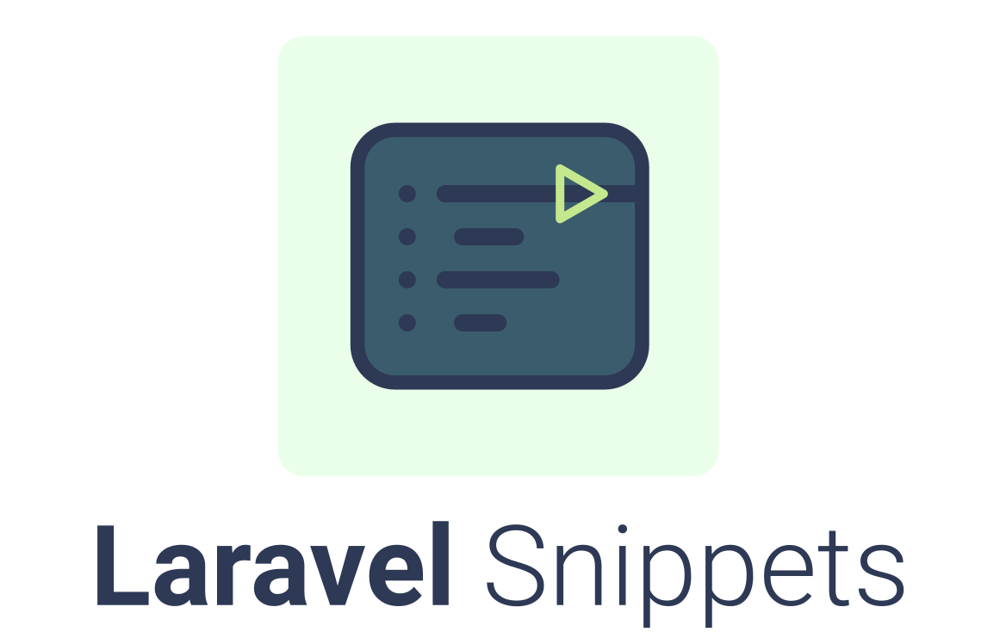

<p align="center"></p>

Run the Laravel documentation examples directly in your browser.

Laravel Snippets is a static rendering of the [Laravel 13.x documentation](https://laravel.com/docs/13.x) where every PHP code block becomes a runnable snippet. It is built on top of [PHP.wasm](https://github.com/WordPress/wordpress-playground), a WebAssembly build of PHP, through the [`@php-wasm/web`](https://www.npmjs.com/package/@php-wasm/web) package. PHP 8.5 boots inside a web worker, loads a Laravel 13 bundle, and executes each snippet entirely in the browser. No server runs any code.

<br>

Browse the documentation and run every example on [the live demo](https://capsulescodes.github.io/laravel-snippets).

<br>

[The report](https://capsulescodes.github.io/laravel-snippets/report) lists every snippet of the documentation and whether it currently runs to completion. Thanks to that report, it is possible to localize the Laravel examples that don't work as-is and report them programmatically.

<br>

> [!NOTE]
> Laravel Snippets is a demonstration of what PHP.wasm snippets can do, not an official Laravel resource. Many thanks to the Laravel team for their outstanding work and documentation.


<br>

## Table of Contents

1. [Installation](#installation)
1. [How it works](#how-it-works)
1. [Auto-updating](#auto-updating)
1. [Snippet report](#snippet-report)
1. [Testing](#testing)
1. [Contributing](#contributing)
1. [Credits](#credits)
1. [License](#license)

<br>

## Installation

**1. Clone the repository**

```bash
git clone https://github.com/capsulescodes/laravel-snippets.git

cd laravel-snippets
```

<br>

**2. Set up the project**

```bash
composer setup
```

- The command installs the PHP and Node dependencies, prepares the `.env` file and builds the assets.

<br>

**3. Start the development server**

```bash
composer dev
```

```bash
> http://localhost:8000
```

<br>

## How it works

- The upstream [`laravel/docs`](https://github.com/laravel/docs) markdown sources are rendered with [`league/commonmark`](https://commonmark.thephpleague.com) into an [Inertia](https://inertiajs.com) + [Vue](https://vuejs.org) application, styled with laravel.com's own compiled CSS.
- A web worker bundled with [Vite](https://vite.dev) boots PHP 8.5 via [`@php-wasm/web`](https://www.npmjs.com/package/@php-wasm/web) and unzips a Laravel 13 framework bundle, so `Illuminate\Support\Collection`, `dump()`, `Lang::get()` and friends resolve inside every snippet.

<br>

## Auto-updating

Laravel Snippets follows the Laravel documentation, so it won't be outdated at one moment in time.

- A scheduled workflow mirrors the upstream `laravel/docs` markdown sources every day.
- A scheduled workflow fetches laravel.com's compiled CSS and fonts every day.
- Each successful sync republishes the static site on GitHub Pages.

<br>

## Snippet report

[The report](https://capsulescodes.github.io/laravel-snippets/report) reflects the latest sweep : a workflow boots each prerendered documentation page in [Playwright](https://playwright.dev), runs every PHP snippet through the PHP.wasm worker and records whether it completes or fails.

- The sweep runs on a weekly schedule and whenever the snippet runtime or the markdown sources change.
- Failing examples are localized per page and per snippet, making it possible to report them programmatically.

<br>

## Testing

```bash
composer test
```

- The command builds the static site, sweeps every snippet with Playwright and merges the results into a report.

<br>

## Contributing

Pull requests are welcome. For major changes, please open an issue first to discuss what you would like to change.
Please make sure to update tests as appropriate.

<br>

## Credits

- [Laravel](https://laravel.com) for the framework and documentation
- [WordPress Playground](https://github.com/WordPress/wordpress-playground) for PHP.wasm and [`@php-wasm/web`](https://www.npmjs.com/package/@php-wasm/web)
- [Claude](https://github.com/anthropics/claude-code) for the assistance
-  [Capsules Codes](https://github.com/capsulescodes)

<br>

## License

[MIT](https://choosealicense.com/licenses/mit/)
